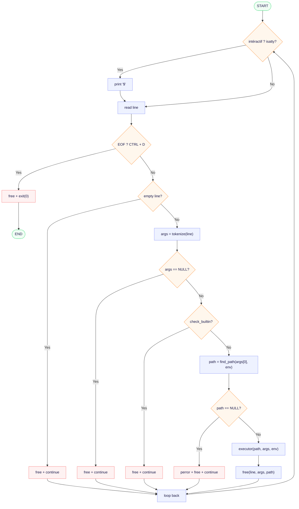

# Simple Shell

A simple UNIX command line interpreter written in C, implemented as part of the Holberton School curriculum.

## Description

Simple Shell is a basic UNIX shell that replicates the core functionalities of `/bin/sh`. It supports both interactive and non-interactive modes, handles environment variables, and implements essential built-in commands.

## Requirements

- Ubuntu 20.04 LTS
- GCC compiler

## Installation

### Clone the repository

```bash
git clone https://github.com/lau-ro19/holbertonschool-simple_shell.git
```

### Go to the directory

```bash
cd holbertonschool-simple_shell
```

### Compile

```bash
gcc -Wall -Werror -Wextra -pedantic -std=gnu89 *.c -o hsh
```

## Usage

### Interactive mode

```bash
$ ./hsh
$ ls
AUTHORS  builtins.c  executor.c  hsh  main.c  parser.c  path.c  shell.h
$ exit
```

### Non-interactive mode

```bash
$ echo "ls" | ./hsh
AUTHORS  builtins.c  executor.c  hsh  main.c  parser.c  path.c  shell.h
```

## Built-in Commands

| Command | Description |
|---------|-------------|
| `exit [status]` | Exit the shell with an optional exit status |
| `env` | Print the current environment variables |

## File Structure

| File | Description |
|------|-------------|
| `main.c` | Main loop and command dispatcher |
| `parser.c` | Input reading and tokenization |
| `executor.c` | Process creation and command execution |
| `path.c` | PATH resolution for commands |
| `builtins.c` | Built-in command implementations |
| `shell.h` | Header file with prototypes and includes |

## Flowchart



## Error Handling

| Error | Output |
|-------|--------|
| Command not found | `prog_name: line_number: command: not found` |
| Fork failure | `fork: error message` |
| Execve failure | `execve: error message` |

## Return Values

| Value | Description |
|-------|-------------|
| 0 | Success |
| 1 | General error |
| 127 | Command not found |

## Man Page

```bash
man ./man_1_simple_shell
```

## Memory Management

All dynamically allocated memory is freed before each loop iteration. The implementation has been tested with Valgrind and reports no memory leaks.

To check for memory leaks :

```bash
valgrind --leak-check=full ./hsh
```

```bash
echo "/bin/ls" | valgrind ./hsh
```

Expected output :

```
==81431== HEAP SUMMARY:
==81431==     in use at exit: 0 bytes in 0 blocks
==81431==   total heap usage: 5 allocs, 5 frees, 4,856 bytes allocated
==81431==
==81431== All heap blocks were freed -- no leaks are possible
==81431==
==81431== ERROR SUMMARY: 0 errors from 0 contexts (suppressed: 0 from 0)
```
```

## Authors

- Nicolas Ojeda
- Laurent Roseantoinette