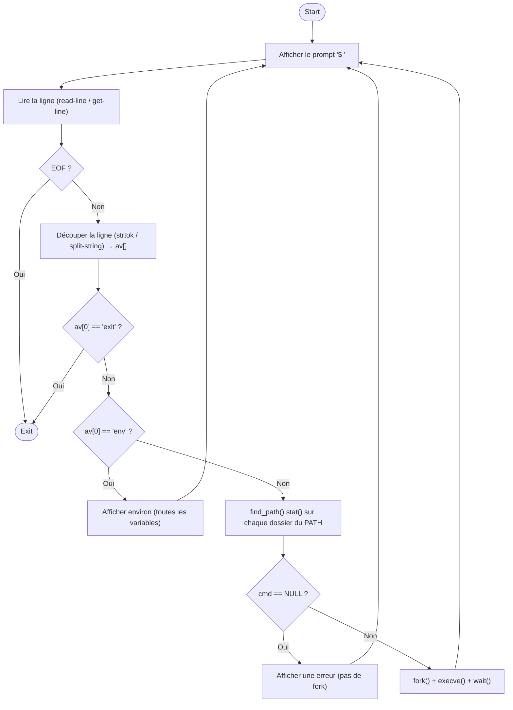

```markdown
# Simple Shell: Command Line Interface to interact with your OS.

## Summary
Simple Shell is a simple command line interface program under GPL license allowing user to send simple commands to manipulate files and get information on OS.
It supports the most essential features a user could expect: support of user $PATH to find programs, propagation of command arguments, error handling, interactive and non-interactive mode.

<details>
<summary><b>Table of Contents (Click to expand)</b></summary>

- [Summary](#summary)
- [How to install and run](#how-to-install-and-run)
  - [Prerequisites](#prerequisites)
  - [1. Downloading](#1-downloading)
  - [2. Compiling](#2-compiling)
- [How to use](#how-to-use)
  - [Starting program](#starting-program)
  - [Usage overview](#usage-overview)
- [Features and limitations](#features-and-limitations)
  - [Supported (v1.0)](#supported-v10)
  - [Not supported (yet)](#not-supported-yet)
  - [Accessible help](#accessible-help)
- [Examples of use](#examples-of-use)
  - [Valid examples](#valid-examples)
  - [Failing examples](#failing-examples)
- [Technical information](#technical-information)
  - [General architecture](#general-architecture)
  - [Process Flow](#process-flow)
  - [Memory management](#memory-management)
- [Testing](#testing)
- [Project constraints and methodology](#project-constraints-and-methodology)
  - [Imposed constraints](#imposed-constraints)
    - [Allowed Functions and System Calls](#allowed-functions-and-system-calls)
    - [Requirements](#requirements)
  - [Project methodology](#project-methodology)
  - [Acknowledgments](#acknowledgments)
- [Technologies Used](#technologies-used)
- [Authors](#authors)
- [License](#license)

</details>

## How to install and run

In a nutshell: ensure you meet all prerequisites (POSIX compatible system, C language libraries, GCC compilation tools and optionally GDB/Valgrind), download the source code, compile it with gcc (quick example `gcc -std=gnu89 *.c -o hsh`) and run it (`./hsh`).

<details>
<summary>Click for detailed information on prerequisites, download and compilation steps</summary>

### Prerequisites
1. This program can only run properly on a POSIX-compliant operating system with support for the "main envp" extension (in short: any GNU/Linux distribution, Mac OS, or a GNU/Linux distribution installed within Windows Subsystem for Linux). As it relies on POSIX APIs.

2. You must have the packages/tools related to C installed on your system, as well as a compiler.  
In case that would help here are some online resources to install those tools depending on your operating system:
  * Windows: please install a Linux distribution using WSL then follow instructions for "installation in Linux" directly within.
  * Mac: [https://www.cs.auckland.ac.nz/~paul/C/Mac/](https://www.cs.auckland.ac.nz/~paul/C/Mac/)
  * Linux (deb package system): [https://jvns.ca/blog/2025/06/10/how-to-compile-a-c-program/](https://jvns.ca/blog/2025/06/10/how-to-compile-a-c-program/)

### 1. Downloading
If you have git and are comfortable with command line, you can clone the repository directly:
```bash
git clone https://github.com/HeroFactory16/holbertonschool-simple_shell.git
```

### 2. Compiling

Open a terminal, go inside the project directory and run the Makefile or compile directly using GCC:

Using Makefile:

```bash
make
```

Using GCC directly:

```bash
gcc -Wall -Werror -Wextra -pedantic -std=gnu89 *.c -o hsh
```

</details>

## How to use

### Starting program

* For an interactive session:

```bash
./hsh
```

* To run in non-interactive mode:

```bash
echo "ls -l" | ./hsh
```

* To make it available system-wide:

```bash
cp ./hsh ~/.local/bin/
```

### Usage overview

Once compiled as `./hsh`, you can manually run it to enter interactive mode where a prompt will be displayed. Alternatively, you can pipe commands into it or pass file input for batch execution.

## Features and limitations

### Supported (v1.0)

* Searching for commands using your PATH environment (`ls`, `pwd`, `cp`, etc.).
* Providing commands with arguments (`ls -latr`, `cp sourcefile filecopy`, etc.).
* Built-in commands:
  * `exit`: Exits the shell with the status code of the last executed command.
  * `env`: Prints all environment variables.
* Full support for interactive mode (with prompt displaying current working directory) and non-interactive mode.
* Precise exit status propagation and standard error handling.

### Not supported (yet)

* Command separators (`;`, `&&`, `||`)
* Pipes (`|`) or redirections (`>`, `<`, `>>`)
* Globbing wildcards (`*`, `?`)
* Variables interpolation (`$VAR`, `$HOME`)
* Quotes for arguments with spaces
* Comments (`#`)
* Job control (`Ctrl+Z`, `bg`, `fg`)

### Accessible help

You can consult the associated man page by running:

```bash
man ./man_1_simple_shell
```

To install it into your local manpage database:

```bash
mkdir -p ~/.local/share/man/man1/
cp ./man_1_simple_shell ~/.local/share/man/man1/hsh.1
mandb
man 1 hsh
```

## Examples of use

<details>
<summary>Click to expand</summary>

### Valid examples

| Use case | Command line |
| --- | --- |
| Listing content of /tmp, sorted from oldest | `echo "ls -latr /tmp" \| ./hsh` |
| Showing current directory | `echo "pwd" \| ./hsh` |
| Printing environment variables | `echo "env" \| ./hsh` |
| Exiting shell | `echo "exit" \| ./hsh` |

### Failing examples

| Use case | Command line |
| --- | --- |
| Pipes between sub-commands | `du -h --max-depth=1 \| sort -hr` |
| Argument protection with quotes | `find . -name "*.c"` |
| Output redirection | `echo "hello" > file.txt` |

</details>

## Technical information

### General architecture

The shell functions via a loop that reads user input line-by-line using `getline`. The input line is then tokenized into individual string arguments using `strtok` (delimited by spaces and tabs).

Before executing external binaries, the shell checks whether the command corresponds to built-in handlers (`exit` or `env`). If it is not a built-in, `search_in_path` scans directories specified in the `PATH` environment variable. When found, a child process is spawned using `fork()` and executed via `execve()`, while the parent waits (`waitpid()`) to capture and store the termination status code.

### Process Flow


```mermaid
flowchart TD
    START([Start]) --> PROMPT["Afficher le prompt '$ '"]
    PROMPT --> READ["Lire la ligne (read-line / get-line)"]
    READ --> CHECK_EOF{"EOF ?"}

    CHECK_EOF -- Oui --> EXIT([Exit])

    CHECK_EOF -- Non --> SPLIT["Découper la ligne (strtok / split-string) → av[]"]
    SPLIT --> CHECK_EXIT{"av[0] == 'exit' ?"}

    CHECK_EXIT -- Oui --> EXIT

    CHECK_EXIT -- Non --> CHECK_ENV{"av[0] == 'env' ?"}

    CHECK_ENV -- Oui --> SHOW_ENV["Afficher environ (toutes les variables)"]
    SHOW_ENV --> PROMPT

    CHECK_ENV -- Non --> FIND_PATH["find_path() stat() sur chaque dossier du PATH"]
    FIND_PATH --> CHECK_CMD{"cmd == NULL ?"}

    CHECK_CMD -- Oui --> ERROR["Afficher une erreur (pas de fork)"]
    ERROR --> PROMPT

    CHECK_CMD -- Non --> EXEC["fork() + execve() + wait()"]
    EXEC --> PROMPT
```

### Memory management

Memory is systematically managed and freed throughout the execution cycle. Dynalloc structures (tokens array, duplicate strings, line buffer) are freed after every iteration inside `free_argv` and dedicated cleanup routines.

Example Valgrind check:

```
==8== 
==8== HEAP SUMMARY:
==8==     in use at exit: 0 bytes in 0 blocks
==8==   total heap usage: 88 allocs, 88 frees, 3,913 bytes allocated
==8== 
==8== All heap blocks were freed -- no leaks are possible
==8== 
==8== ERROR SUMMARY: 0 errors from 0 contexts (suppressed: 0 from 0)
```

## Testing

The shell was tested against both interactive edge cases and automated checker test suites (Valgrind leak checks, syntax verification, exit status matches).

To test memory leaks manually:

```bash
valgrind --leak-check=full --show-leak-kinds=all --track-origins=yes ./hsh
```

## Project constraints and methodology

### Imposed constraints

#### Allowed Functions and System Calls

* **String functions:** `strlen`, `strcpy`, `strcat`, `strcmp`, `strdup`, `strtok`
* **I/O:** `printf`, `fprintf`, `putchar`, `getline`, `perror`
* **Memory:** `malloc`, `free`
* **Process:** `fork`, `execve`, `wait`, `waitpid`, `exit`, `_exit`
* **File:** `access`, `stat`, `open`, `close`, `read`, `write`
* **Directory:** `opendir`, `readdir`, `closedir`
* **Environment:** `getenv`, `isatty`, `getpid`
* **Other:** `signal`, `kill`, `fflush`

#### Requirements

* All code compiled with: `gcc -Wall -Werror -Wextra -pedantic -std=gnu89`
* Betty style compliant
* Zero memory leaks
* Maximum 5 functions per file
* Header files include guarded (`shell.h`)

### Project methodology

1. Continuous peer review through GitHub pull requests.
2. Compliance checking with `betty` before commits.
3. Systemic status verification and memory tracking using Valgrind.

### Acknowledgments

* Holberton School curriculum guidance and project specifications.
* Betty linter contributors.

## Technologies Used

<p align="left">
    
    
    
    
    
    
</p>

## Authors

* **Cédric COINDARD--LAGRESLE** - GitHub: [HeroFactory16](https://github.com/HeroFactory16) - Email: `cedric.coinlag@gmail.com`
* **Laurent ROSE-ANTOINETTE** - GitHub: [lau-ro19](https://github.com/lau-ro19)

## License

This project is part of the Holberton School curriculum and is released under the GNU General Public License v3.0.
```